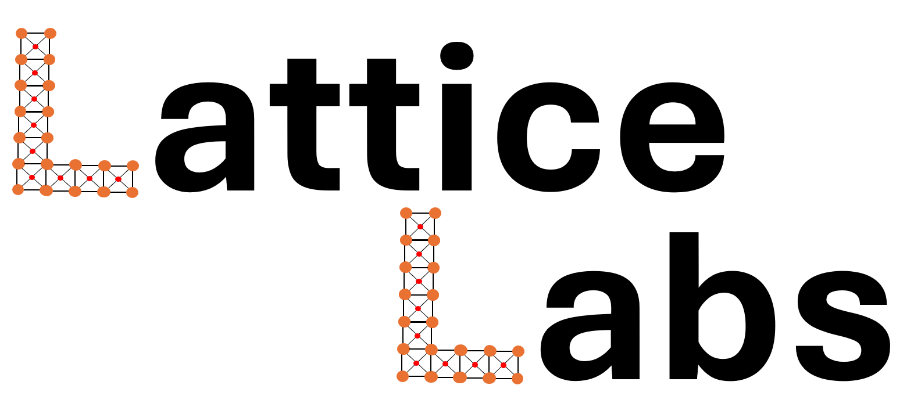

# LatticeLabs

# Overview
A Python-based platform designed to make learning the Lattice Boltzmann Method (LBM) accessible and engaging. LatticeLabs provides intuitive tools, simulations, and resources to help students, researchers, and enthusiasts explore the principles and applications of LBM in fluid dynamics and beyond.
